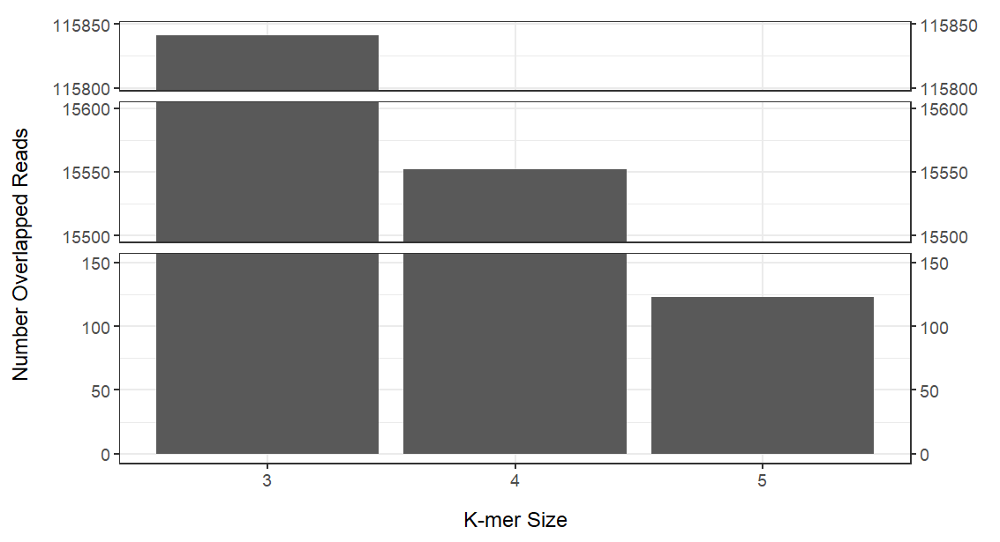

# De Bruijn Graphs for Genome Assembly

The repository implements a De Bruijn Graph (DBG) approach for genome assembly. The 
required inputs are two FATSA files, one of a target query and another of all reads.
The additional required input is the desired k-mer size to be used in DBG assembly.
This tool is useful for de-novo genome assembly and can be particularly relevant to
microbiome analysis.

## Setup
To install from git: 

    git clone https://github.com/jillhoffman/DBG-GenomeAssembly.git
    cd DBG-GenomeAssembly

Set up virtual environment and install requirements:    
*Please note that BioPython is only used for parsing of fasta files*

    virtualenv venv
    source venv/bin/activate
    pip install -r install/requirements.txt 

## Description of Scripts

**main.py:** Main script to run     
**makekmers.py:** Cuts strings into k-mers of desired size  
**matchkmers.py:** Finds reads with 10%-90% k-mer similarity to the query read
**mapping.py:** Creates dictionary to map k-mers
**order.py:** Functions to put unique k-mers into the correct order for DBG assembly 
**output.py:** Preps information for .aln output file
**unittesting.py:** Unit testing for functions 

## To Run

**Required Input Files:**   
The following inputs are required and are passed as arguments in the following order through command line.

* **query.fasta:** fasta file containing all target reads
* **query.fasta:** fasta file containing all reference reads
* **kmer_size** desired size of k-mers to be used 

Example data is provided in the *example_data* folder. This folder contains
a large *READS.fasta* file of all reference reads and smaller 
*READS.##.fasta* files, each containing ~12,000 sequences. The smaller files are recommended to 
use for testing as run time is only ~4 minutes, compared to 19 minutes for all sequences. Below shows statistics 
of identified reads based on different k-mer sizes. The recommended k-mer size for the example data is 4.



**The example can be run by:**

```
python scripts/main.py ./example_data/QUERY.fasta ./example_data/READS.01.fasta  4
```
In this example the first set of 12,000 reads are being used and a 4-mers are being used. The "01" in *READS.01.fasta* 
can be switched with any number 01-09, or for the whole file *READS.fasta*

**Output using test file:**
```
creating 4-mers...
matching 12434 reads to initial query...
matched 9545 reads
time elapsed: 115 seconds
extending original query...
assembled 1 alleles with 658 bps
time elapsed: 2 seconds
```
**Output using whole file:**

```
creating 4-mers...
matching 124520 reads to initial query...
matched 96582 reads
time elapsed: 1136 seconds
extending original query...
assembled 1 alleles with 658 bps
time elapsed: 25 seconds
```
The following output files include stats on the longest created contig. Example files can be found in the outputs folder:

**ALLELES.fasta:** FASTA file containing the sequence of the longest created contig     
**ALLELES.aln:** Tab-delimeted file mapping location of reads in the contig

## Testing

Unittesting for the modules has been implemented. Manually curated ground truth examples were created for input to test
basic functionality of the different functions. To run unit test script:
    
    cd ./scripts 
    python -m unittest unittesting.py

Output:

    Ran 6 tests in 0.002s
    OK

